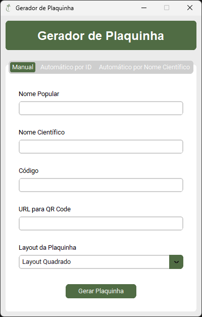
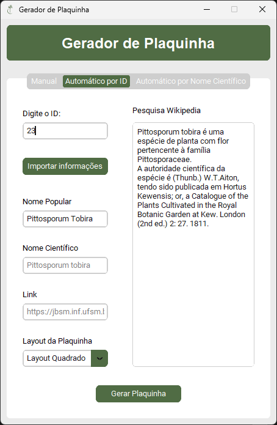
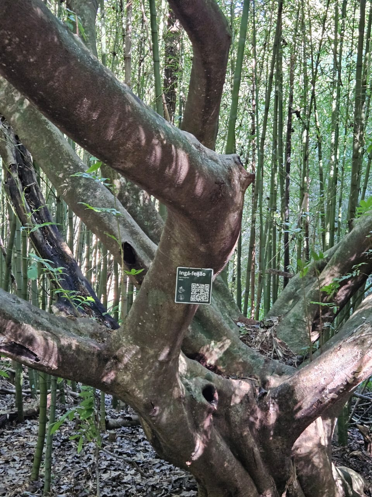

# Plaquinhas Jardim Botanico
Este projeto tem como objetivo desenvolver plaquinhas interativas com o usuário para o Jardim Botanico de Santa Maria de maneira automatizada usando um aplicativo próprio.

## Funcionalidade
O gerador executável de plaquinhas, implementado em Python, é capaz de gerar plaquinhas padronizadas seguindo 3 modelos para escolha. Cada plaquinha contém um QRCode que direciona à página da planta no site do Jardim Botânico que também foi implementado por outra equipe neste projeto, trazendo ao usuário curiosidades sobre a espécie. Existem 3 modos de geração:

### Modo Manual
No modo manual, o usuário deve preencher manualmente os campos da plaquinha.

### Modo Automático por ID & Modo Automático por Nome Científico
Nos modos automáticos, o usuário deve preencher um dos dois seguinte: O id na base de dado interna do Jardim Botânico ou o nome científico da planta. Após isso, são preenchidos automaticamente os campos restantes, além de apresentar um campo de pesquisa na Wikipedia a fim de obter uma descrição da planta contendo o nome popular, que não está incluso na base de dados interna.

## Resultado Final
Este é o arquivo pdf final gerado pelo programa, destinado para impressão:

## Aplicação no mundo real
Instalamos dez destas plaquinhas no Jardim Botânico da Universidade Federal de Santa Maria! Aqui abaixo está o exemplar de Ingá-feijão com sua plaquinha.

Para usar o gerador basta instalar o executável!
